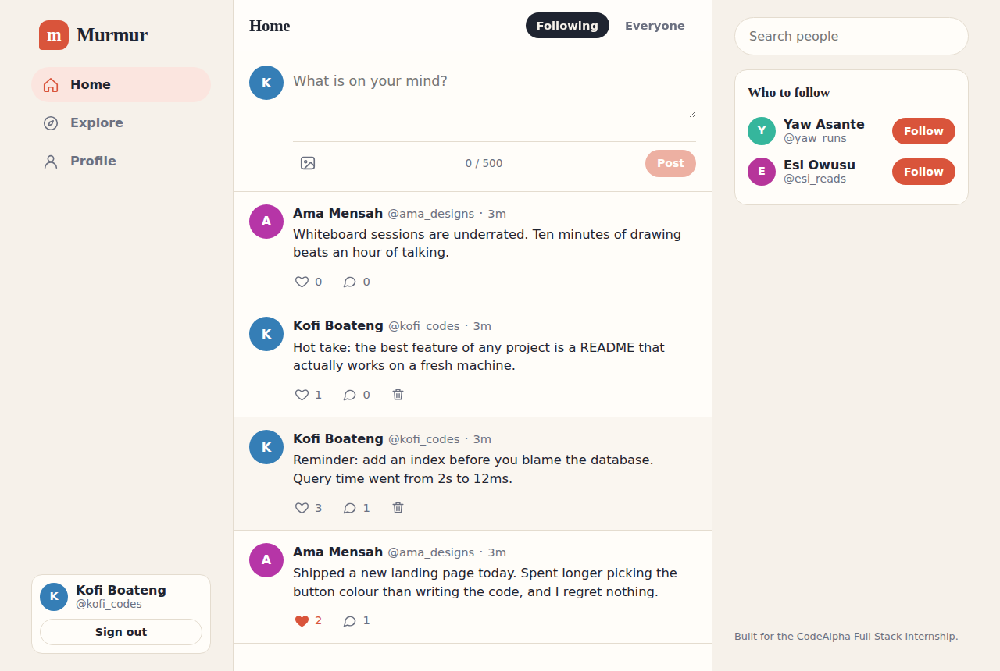

# CodeAlpha_SocialMedia

**Murmur** is a mini social media platform built as **Task 2** of the [CodeAlpha](https://www.codealpha.tech) Full Stack Development Internship. People can create profiles, write posts, comment, like, and follow each other. The home feed shows posts from the people you follow.




## Features

- **User accounts:** register and sign in with email or username. Passwords are hashed with bcrypt and sessions use JWTs.
- **Profiles:** name, username, bio, and photo link, with post, follower, and following counts. You can edit your own profile.
- **Posts:** up to 500 characters with an optional image link. You can delete your own posts.
- **Comments:** add comments to any post. The comment author or the post owner can delete a comment.
- **Likes:** like and unlike posts, with live counts.
- **Follow system:** follow and unfollow people, and view followers and following lists.
- **Feeds:** a **Following** feed (your posts plus people you follow) and an **Everyone** feed, both with "Load more" pagination.
- **Search and suggestions:** find people by name or username, and see who to follow.
- **Responsive design** with light and dark themes.

## Tech Stack

| Layer    | Technology                                   |
|----------|----------------------------------------------|
| Frontend | HTML, CSS, JavaScript (no framework)         |
| Backend  | Node.js, Express.js                          |
| Database | MySQL 8                                      |
| Auth     | bcryptjs (password hashing), JSON Web Tokens |
| Testing  | Node's built-in test runner                  |

## Project Structure

```
CodeAlpha_SocialMedia/
├── client/
│   ├── index.html
│   ├── css/styles.css
│   └── js/app.js            # Single-page UI: feeds, profiles, likes, comments, follows
├── server/
│   ├── config/jwt.js
│   ├── db/                  # connection.js, schema.sql, migrate.js, seed.js
│   ├── lib/                 # validate.js, posts.js (shared post query)
│   ├── middleware/          # require-auth, require-database, rate-limit
│   └── routes/              # auth, users, posts, health
├── tests/                   # unit tests + MySQL integration test
├── docs/screenshots/
├── app.js                   # Express app
├── server.js                # Starts the server
├── .env.example
└── package.json
```

## Database Schema

| Table      | Columns                                                                                   |
|------------|-------------------------------------------------------------------------------------------|
| `users`    | `id`, `username` (unique), `name`, `email` (unique), `password_hash`, `bio`, `avatar_url`, `created_at` |
| `posts`    | `id`, `user_id`, `content`, `image_url`, `created_at`                                     |
| `comments` | `id`, `post_id`, `user_id`, `content`, `created_at`                                       |
| `likes`    | `user_id`, `post_id`, `created_at` (primary key on `user_id, post_id`: one like per user) |
| `follows`  | `follower_id`, `following_id`, `created_at` (primary key on both: one follow per pair)    |

Deleting a user removes their posts, comments, likes, and follows (`ON DELETE CASCADE`). A user cannot follow themselves; the API enforces this because MySQL does not allow a `CHECK` constraint on columns that use `ON DELETE CASCADE`.

`server/db/schema.sql` is the single source of truth. The server runs it on every startup (all statements use `CREATE TABLE IF NOT EXISTS`), so you only need to create the empty database.

## API Endpoints

Endpoints marked **auth** need an `Authorization: Bearer <token>` header.

### Auth
| Method | Endpoint             | Description                                                    |
|--------|----------------------|----------------------------------------------------------------|
| POST   | `/api/auth/register` | Create an account (`name`, `username`, `email`, `password`)    |
| POST   | `/api/auth/login`    | Sign in (`identifier` = email or username, `password`)         |
| GET    | `/api/auth/me`       | Current user (**auth**)                                        |

### Users
| Method | Endpoint                          | Description                                          |
|--------|-----------------------------------|------------------------------------------------------|
| GET    | `/api/users?q=`                   | Search people by username or name                    |
| GET    | `/api/users/suggestions`          | People you may want to follow (**auth**)             |
| PATCH  | `/api/users/me`                   | Update your `name`, `bio`, or `avatar_url` (**auth**) |
| GET    | `/api/users/:username`            | Profile with counts and `is_following`               |
| GET    | `/api/users/:username/posts`      | A user's posts (`limit`, `before`)                   |
| GET    | `/api/users/:username/followers`  | Followers list                                       |
| GET    | `/api/users/:username/following`  | Following list                                       |
| POST   | `/api/users/:username/follow`     | Follow (**auth**)                                    |
| DELETE | `/api/users/:username/follow`     | Unfollow (**auth**)                                  |

### Posts
| Method | Endpoint                               | Description                                        |
|--------|----------------------------------------|----------------------------------------------------|
| GET    | `/api/posts/feed`                      | Your posts plus people you follow (**auth**)       |
| GET    | `/api/posts`                           | Everyone's posts (`limit`, `before`)               |
| POST   | `/api/posts`                           | Create a post (`content`, optional `image_url`) (**auth**) |
| GET    | `/api/posts/:id`                       | One post                                           |
| DELETE | `/api/posts/:id`                       | Delete your own post (**auth**)                    |
| POST   | `/api/posts/:id/like`                  | Like (**auth**)                                    |
| DELETE | `/api/posts/:id/like`                  | Unlike (**auth**)                                  |
| GET    | `/api/posts/:id/comments`              | List comments                                      |
| POST   | `/api/posts/:id/comments`              | Add a comment (**auth**)                           |
| DELETE | `/api/posts/:id/comments/:commentId`   | Delete a comment as its author or the post owner (**auth**) |

Feeds are paginated: pass `limit` (max 30) and `before` (a post id). Each response includes `next_before`, which is `null` on the last page.

### Other
| Method | Endpoint      | Description                |
|--------|---------------|----------------------------|
| GET    | `/api/health` | Server and database status |

## Getting Started

### Prerequisites

- [Node.js](https://nodejs.org/) v18 or later
- [MySQL](https://dev.mysql.com/downloads/mysql/) v8.0 or later (MariaDB is not supported)

### Installation

1. **Clone the repository**
   ```bash
   git clone https://github.com/<your-username>/CodeAlpha_SocialMedia.git
   cd CodeAlpha_SocialMedia
   ```

2. **Install dependencies**
   ```bash
   npm install
   ```

3. **Create the database and an application user**

   In MySQL Workbench (or the `mysql` prompt), run:
   ```sql
   CREATE DATABASE murmur_social CHARACTER SET utf8mb4 COLLATE utf8mb4_0900_ai_ci;
   CREATE USER 'murmur_app'@'localhost' IDENTIFIED BY 'replace_with_a_strong_password';
   GRANT SELECT, INSERT, UPDATE, DELETE, CREATE, ALTER, INDEX, REFERENCES ON murmur_social.* TO 'murmur_app'@'localhost';
   ```
   The server creates the tables itself when it starts, which is why the user needs `CREATE`, `ALTER`, `INDEX`, and `REFERENCES`. For quick local use you can also put your `root` login in `.env`.

4. **Configure environment variables**

   Copy `.env.example` to `.env` and fill it in:
   ```env
   PORT=5000
   DB_HOST=localhost
   DB_PORT=3306
   DB_USER=murmur_app
   DB_PASSWORD=replace_with_a_strong_password
   DB_NAME=murmur_social
   JWT_SECRET=replace_with_a_random_string_of_at_least_32_characters
   MYSQL_SSL=false
   ```
   Generate a secret with:
   ```bash
   node -e "console.log(require('crypto').randomBytes(48).toString('hex'))"
   ```

5. **(Optional) Add demo data**
   ```bash
   npm run seed
   ```
   This creates four demo people with posts, follows, likes, and comments. Sign in as `ama_designs`, `kofi_codes`, `esi_reads`, or `yaw_runs` with the password `Password123!`. These accounts are for local demos only.

6. **Start the server**
   ```bash
   npm start
   ```
   Open `http://localhost:5000`. `/api/health` reports the database status.

## Tests

```bash
npm test                    # unit tests: validation and middleware (no database needed)
npm run test:integration    # full API test against your MySQL database (uses .env)
```

The integration test registers its own temporary users (with a random suffix), exercises every endpoint including permission checks, and deletes those users afterwards.

## Security Notes

- Passwords are hashed with bcrypt and never returned by the API. Profiles and search results never include email addresses.
- Protected routes verify a JWT on every request, and users can only edit or delete their own posts, comments, and profile.
- All database queries use parameterized statements. User text is escaped before it is shown, so pasted HTML appears as plain text.
- Image links must be `http` or `https`.
- Sign-in and registration are rate limited per IP address.
- Secrets live in `.env`, which is excluded from version control.

## Future Improvements

- Image uploads instead of image links
- Notifications for likes, comments, and new followers
- Real-time feed updates with WebSockets
- Replies to comments and hashtags

## Author

**Storm**
[GitHub](https://github.com/244star)

## Acknowledgements

Built as part of the Full Stack Development internship at [CodeAlpha](https://www.codealpha.tech).
